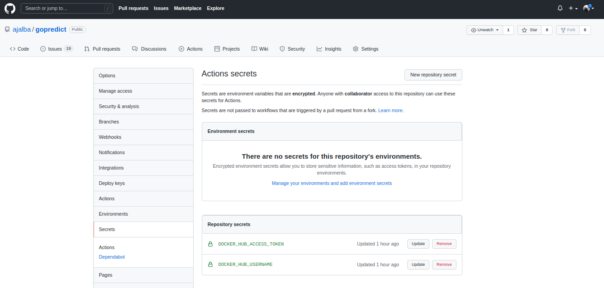

# Dockerhub y configuración de la actualización automática del contenedor

El primer paso realizado ha sido crear una cuenta en [Dockerhub](https://hub.docker.com/) y en ella crear un repositorio con el nombre del proyecto. A continuación se ha subido la imagen de forma manual como primera y única vez mediante ```docker push <hub-user>/<repo-name>:<tag>```, una imagen creada con ```docker build -t <hub-user>/<repo-name>[:<tag>]```.

Lo óptimo sería poder construir la imagen y subirla automáticamente a DockerHub hub cada vez que se actualiza la rama main. Para ello se va a emplear GitHub Action, planteada para realizar las siguientes tareas:

1. Comprobar el estado del repositorio
2. Hacer loggin en DockerHub
3. Contruir y subir el contenedor al DockerHub

Para ello se va a seguir la documentación oficial de DockerHub en cuanto a esta temática que se encuentra [aquí](https://docs.docker.com/ci-cd/github-actions/#set-up-a-docker-project). El primer paso es crear los secrets del repositorio con un access token y el username de DockerHub. Es sencillo en **Settings -> Secrets -> New Repository Secret**, el resultado se puede ver en la imagen.



El siguiente paso es hacer que el workflow se triggee cuando sucede un push a la rama main, después crear un trabajo que checkee el repositorio, haga login en Docker Hub y realice la actualización automática. A continuación se ha creado un workflow con el objetivo de complir las tareas previamente descritas:

```
# Nombra el workflow

name: DockerHub abeljosesanchez/gopredict

# Controla cuando va a ejecutarse el workflow
on:
  # Trigger en push a la rama main
  push:
    branches: [ main ]

# Trabajos del workflow
jobs:
  # Un solo trabajo llamado docker
  docker:
    
    runs-on: ubuntu-latest

    # Pasos del trabajo
    steps:
      # Checkea el repositorio
      - name: checkout repo
      - uses: actions/checkout@v2
      # Login a Docker Hub
      - name: Login to Docker Hub
        uses: docker/login-action@v1
        with:
          username: ${{ secrets.DOCKER_HUB_USERNAME }}
          password: ${{ secrets.DOCKER_HUB_ACCESS_TOKEN }}
      #Crea y pushea la imagen al repositorio
      - name: Build and push
        uses: docker/build-push-action@v2
        with:
          context: .
          push: true
          tags: ${{ secrets.DOCKER_HUB_USERNAME }}/gopredict
```
