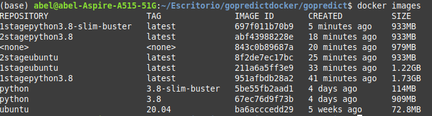

# Documentación del Dockerfile

## Elección de la imagen

Para seleccionar la imagen base del dockerfile se han tomado en consideración diferentes builds de Dockerfile. Comenzando por tomar una imagen base del lenguaje que se va a utilizar, en este caso __python__. La versión de la imagen base de python seleccinada ha sido la versión 3.8, ya que las últimas versiones del lenguaje han reportado fallos con la biblioteca empleada en el proyecto en su uso con docker, como se puede ver en este [enlace](https://discuss.streamlit.io/t/error-running-streamlit-docker/2940/6).

La primera imagen se ha construido con el siguiente dockerfile, donde __installwheel__ es una tarea gestionada por invoke. 

```dockerfile
FROM python:3.8 as builder
COPY tasks.py .
RUN pip install invoke && invoke installwheel
RUN pip install --no-cache /wheels/*
WORKDIR /app/test
ENTRYPOINT [ "invoke","test" ]

```

Dado que se toma una versión completa del lenguaje oficial, el resultado es una imagen bastante pesada debido a la propia imagen y las dependencias del proyecto, posee un tamaño de 1.73GB. A continuación se ha considerado tomar como base una imagen de Ubuntu 20.04 y en él, instalar python y las dependencias del proyecto. El resultado es el siguiente Dockerfile:

```dockerfile
FROM ubuntu:20.04 as builder
COPY tasks.py .
RUN apt-get update && apt-get install -y python3 
RUN apt-get install -y pip &&\
    pip install invoke && invoke installwheel && rm tasks.py\
    && pip install --no-cache /wheels/*
WORKDIR /app/test
ENTRYPOINT [ "invoke","test" ]
```

El resultado es una imagen más ligera pero aún demasidado pesada, tiene un peso de 1.22GB, es por eso que se considera tomar una construcción multi stage, es decir, construir a partir de estas imágenes pesadas una imagen con solo lo necesario para que la aplicación pueda funcionar. Comenzamos empleando esto con la base de Ubuntu, la segunda etapa del dockerfile tendrá como base una imagen de python de tamaño reducido, como es la imagen __slim-buster__ de python3.8. El dockerfile sería el siguiente:

```dockerfile
FROM ubuntu:20.04 as builder
COPY tasks.py .
RUN apt-get update && apt-get install -y python3 
RUN apt-get install -y pip &&\
    pip install invoke && invoke installwheel && rm tasks.py
FROM python:3.8-slim-buster
COPY --from=builder /wheels /wheels
RUN pip install --no-cache /wheels/*
WORKDIR /app/test
ENTRYPOINT [ "invoke","test" ]
```

Esto proporciona una imagen de menor tamaño, un total de 933MB, es por esto que se ha decidido tomar el mismo método para la imagen oficial del lenguaje, de la siguiente forma:

```dockerfile
FROM python:3.8 as builder
COPY tasks.py .
RUN pip install invoke && invoke installwheel && rm tasks.py
FROM python:3.8-slim-buster
COPY --from=builder /wheels /wheels
RUN pip install --no-cache /wheels/*
WORKDIR /app/test
ENTRYPOINT [ "invoke","test" ]
```

El resultado es una imagen de exactamente el mismo tamaño, pues es la misma imagen base en la segunda etapa y las mismas dependencias, con un tiempo de build un poco menor debido a que en la imagen de ubuntu es necesario instalar python y este paso toma tiempo. Como imagen final se ha considerado construir una imagen base con la versión __slim-buster__ de python3.8 directamente, ignorando una build en 2 etapas y construyendo e instalando directamente sobre __python:3.8-slim-buster__, resultando el dockerfile de la imagen base como sigue:

```dockerfile
FROM python:3.8-slim-buster as builder
COPY tasks.py .
RUN pip install invoke && invoke installwheel && rm tasks.py
RUN pip install --no-cache /wheels/*
WORKDIR /app/test
ENTRYPOINT [ "invoke","test" ]
```

El resultado es una imagen del mismo tamaño que las anteriores pero con menos tiempo de creación, por lo que se ha elegido como imagen base. En la siguiente imagen se puede ver el tamaño de todas las imágenes creadas para esta elección. 

## Dockerfile

El fichero __Dockerfile__ ha sido construido tomando como base la imagen que se ha discutido en la sección anterior. Se crea un usuario para instalar las dependencias en su espacio y se ha creado una tarea de invoke para instalar las dependencias. En el proceso se toma la base, se crea un usuario, en el espacio del usuario se instala el gestor de tareas y se ejecuta la tarea para instalar las dependencias de la aplicación y finalmente se designa el punto de entrada para los tests.

```dockerfile
FROM python:3.8-slim-buster as builder
ENV PATH="/home/gopredict/.local/bin:${PATH}"
RUN useradd -m gopredict \
    && mkdir -p app/test \
    && chown gopredict:gopredict -R /app/test
USER gopredict
WORKDIR /app/test
COPY tasks.py .
RUN pip install invoke && invoke install && rm tasks.py
ENTRYPOINT [ "invoke","test" ]
```
